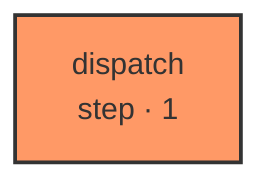

# coxswain

One node, one role. Given a docket describing what is on hand right now — the graph registry, the intake queue, the ready set, the ledger's shape — decide which graphs to run next, and say why. That decision is judgment, exactly like every other decision this codebase hands to a model, so it lives in a graph like every other one: pure, replayable, no disk, no clock.

| Node | Step |
|---|---|
| `dispatch` | 1 |
