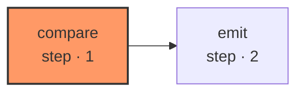

# epic-reconcile

`lifecycle-propose` scopes work *into* an epic. Nothing until now looked at whether the epic still describes reality afterwards, and epics drift: tickets get closed on the board and not in the epic, phases finish out of order, work gets added that nobody attached. An epic model that is only ever written and never checked degrades into a diagram of what someone once intended.

| Node | Step |
|---|---|
| `compare` | 1 |
| `emit` | 2 |
