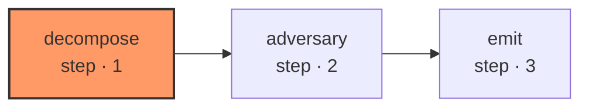

# initiative-decompose

The front of the pipeline, and the step that makes everything after it parallelisable. An idea arrives as prose; what comes out is phases, tasks, and the dependency edges between them — and one `item_create` proposal per task.

| Node | Step |
|---|---|
| `decompose` | 1 |
| `adversary` | 2 |
| `emit` | 3 |
