# lifecycle-propose

Takes one task, produces reviewed work and proposals. Nothing is pushed, opened, or merged. The build node returns a patch; applying it is the shell's job, inside a worktree the shell owns.

```mermaid
flowchart LR
    n0["scope<br/>step · 1"]
    n1["plan<br/>step · 2"]
    n2["plan_alternative<br/>step · 3"]
    n3["plan_arbitrate<br/>step · 4"]
    n4["plan_adversary<br/>step · 5"]
    n5["build (worktree)<br/>step · 6"]
    n6["handoff<br/>step · 7"]
    n7["review<br/>step · 8"]
    n8["adversary<br/>step · 9"]
    n9["arbitrate<br/>step · 10"]
    n10["emit<br/>step · 11"]
    n0 --> n1
    n1 --> n2
    n2 --> n3
    n3 --> n4
    n4 --> n5
    n5 --> n6
    n6 --> n7
    n7 --> n8
    n8 --> n9
    n9 --> n10
    style n0 fill:#f96,stroke:#333,stroke-width:2px
```

| Node | Step |
|---|---|
| `scope` | 1 |
| `plan` | 2 |
| `plan_alternative` | 3 |
| `plan_arbitrate` | 4 |
| `plan_adversary` | 5 |
| `build (worktree)` | 6 |
| `handoff` | 7 |
| `review` | 8 |
| `adversary` | 9 |
| `arbitrate` | 10 |
| `emit` | 11 |
