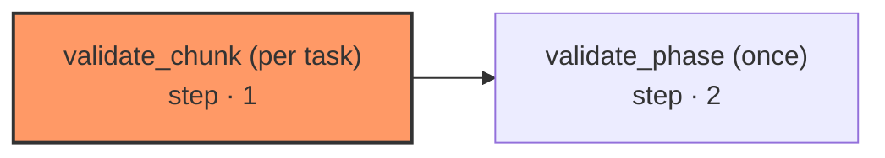

# phase-validate

The two validators the epic-swarm spec asks for, as a graph. They are model calls, and model calls belong in graphs — a driver that called the runner directly would be the first non-graph thing in the system to do so, and every purity rule the portability suite enforces would stop applying to the two nodes whose judgment the phase boundary rests on. So the driver invokes this the way it invokes any other graph, through `invoke_graphs`, and gets back an opinion rather than a decision.

| Node | Step |
|---|---|
| `validate_chunk (per task)` | 1 |
| `validate_phase (once)` | 2 |
