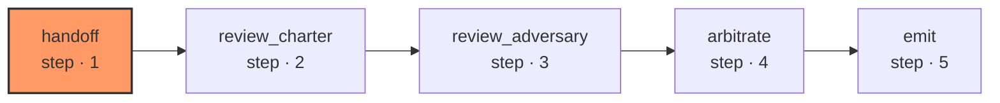

# rescue-review

Takes a ticket, a patch and the evidence rows the harness produced by running the checks, and returns a verdict shaped like a lifecycle result so the driver reads it the same way. There is no plan node, no build node and no fix loop: one review round, and the verdict is final.

| Node | Step |
|---|---|
| `handoff` | 1 |
| `review_charter` | 2 |
| `review_adversary` | 3 |
| `arbitrate` | 4 |
| `emit` | 5 |
