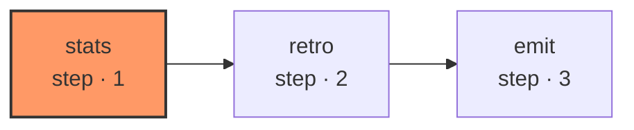

# retro-propose

A retro over a running system is not a model asked "how did we do" from memory — memory is exactly what the ledger exists to disbelieve. So the stats this graph reasons about are computed HERE, mechanically, as pure dict arithmetic over the rows the harness read: per `(kind, subject)` bucket, the outcome counts, the current consecutive-clean streak (a clean that took more than one build attempt is transparent, same rule the policy itself uses so a struggling loop cannot manufacture the record it stands on), the reversal count, and how many cleans were not first-try.

| Node | Step |
|---|---|
| `stats` | 1 |
| `retro` | 2 |
| `emit` | 3 |
