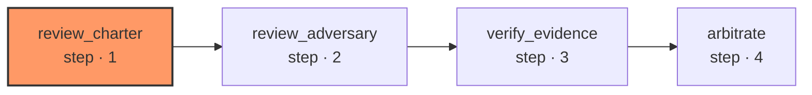

# review-diff

Takes a diff, a repo and a ref — never a run's own build branch — and returns the same verdict-and-findings shape a build's own review step produces. Nothing is written to the repo and nothing is pushed.

| Node | Step |
|---|---|
| `review_charter` | 1 |
| `review_adversary` | 2 |
| `verify_evidence` | 3 |
| `arbitrate` | 4 |
