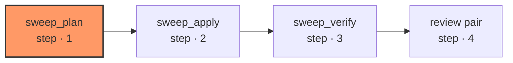

# sweep

The complement to `decompose`: work that needs no per-unit design, only one judgment call applied everywhere it matches. `sweep_plan` reads the whole repository through its own tool loop and writes the map, the exceptions and the application; this module never touches a filesystem itself outside `sweep_apply`, which is the edge that runs the script or the one build call. `sweep_verify` takes what `sweep_apply` already captured — no model, no I/O of its own — and the review pair on the one resulting diff is `review-diff`, the same pair every other graph here uses, not a copy of it.

| Node | Step |
|---|---|
| `sweep_plan` | 1 |
| `sweep_apply` | 2 |
| `sweep_verify` | 3 |
| `review pair` | 4 |
