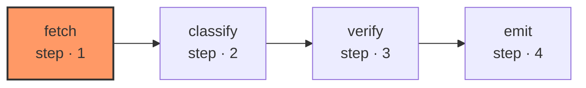

# triage-propose

Alerts arrive as an argument rather than being fetched here. A graph that reads a queue reads the world, and the contract puts both the filesystem and the clock on the far side of the graph boundary for the same reason: a graph that cannot be replayed cannot be debugged after the fact.

| Node | Step |
|---|---|
| `fetch` | 1 |
| `classify` | 2 |
| `verify` | 3 |
| `emit` | 4 |
