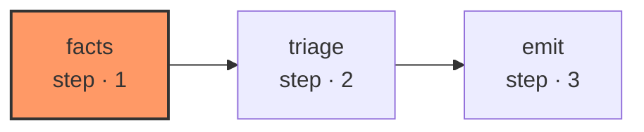

# triage

The triage role classifies a stranded item against `facts` and must cite the record; `emit` builds the write by class — a `ticket_amend` proposal, an `item_create` proposal, a `decompose` handoff, or a `notify` proposal — and refuses to repeat an already-fired `(class, diagnosis)` pair on the same item, escalating to a person instead.

| Node | Step |
|---|---|
| `facts` | 1 |
| `triage` | 2 |
| `emit` | 3 |
