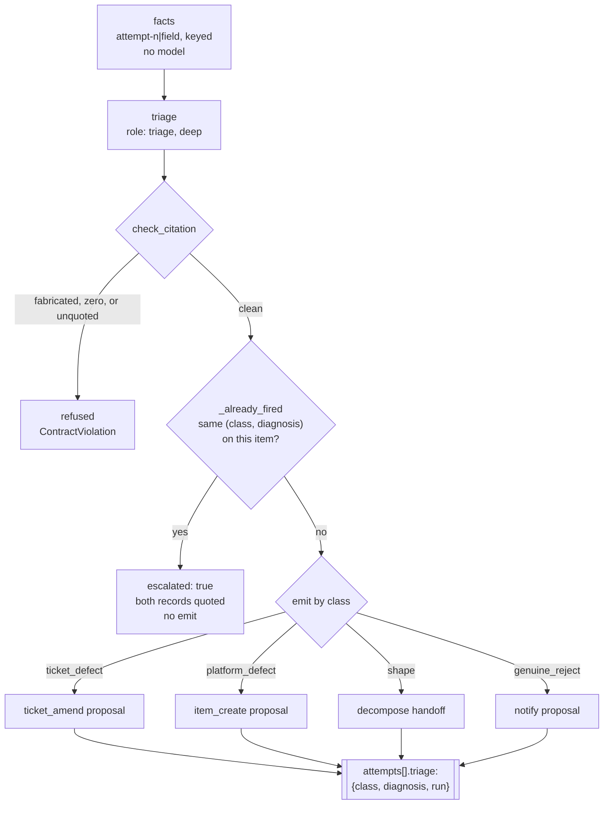

# triage-quarantine — specification

Classifies a stranded item at the attempt cap and emits by class. See
[`docs/design/triage.md`](../../docs/design/triage.md) §1 for the decided
design; this page is the graph's own shape.

| Node | Role | Tier | Notes |
|---|---|---|---|
| `facts` | — | — | pure arithmetic over the work item and its attempts; no model |
| `triage` | `triage` | deep | `{class, diagnosis, cites[], action}`; a fabricated cite, zero cites, or a diagnosis quoting no record text is refused |
| `emit` | — | — | the class table below, or an escalation when the pair already fired |

**Args:** `run_id`, `date`, `cartridge` (required, no fallback), `work_item`,
`attempts`.

## The class table

| Class | Emits |
|---|---|
| `ticket_defect` | a `ticket_amend` proposal carrying the exact text to append |
| `platform_defect` | an `item_create` intake proposal naming the mechanism |
| `shape` | a `decompose` handoff — the split is decompose's job, not triage's |
| `genuine_reject` | a `notify` proposal; the item stays `ready` with the classification recorded |

## Never the same pair twice

`_already_fired` reads `attempts[].triage` for a prior `(class, diagnosis)`
match before `emit` runs. A repeat is not more evidence — it is the same
reasoning restated — so it escalates to a person, quoting both records,
instead of clearing the cap again. This is why `emit` never sees a class it
has already used on this exact diagnosis for this item.

**Status:** `facts` and `check_citation` are implemented in
[`triage_quarantine.py`](triage_quarantine.py) (docs/design/triage.md §1);
`triage` and `emit` land in the same module. The additive-diff check on a
`ticket_amend` proposal (§2) and `cox runs stranded` (§3) are separate,
later work.
